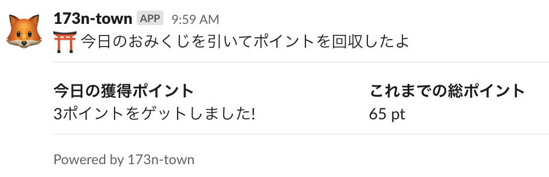

# 173n-town

Crawling the 173n Town website and posting "Omikuji" results to Slack.



## Getting started

```
docker run --rm -it \
  -e TOWN_USER=[Email address] \
  -e TOWN_PASS=[Raw password] \
  -e SLACK_WEBHOOK_URL=[Slack incomming webhook URL] \
  ghcr.io/windyakin/173n-town
```

## Environments

Variable name | Description | Example
:-- | :-- | :--
`TOWN_USER` * | 173n Town login ID (Email address) | `173n-town@example.com`
`TOWN_PASS` * | 173n Town login password (Raw value) | `passw0rd`
`SLACK_WEBHOOK_URL` * | [Incomming webhook url of Slack](https://api.slack.com/incoming-webhooks) to post | `https://hooks.slack.com/...`
`PUPPETEER_TIMEOUT` | [Puppeteer](https://github.com/puppeteer/puppeteer) time out time (milli second). Default value is 30000 | `30000`
`CHROME_EXECUTABLE_PATH` | Entrypoint path of Google Chrome (puppeteer's `executablePath` option) | `/usr/bin/chromium`

`*`: Required parameters

## License

This program is under the [MIT License](LICENSE)

## Copyright

&copy; 2022 windyakin
